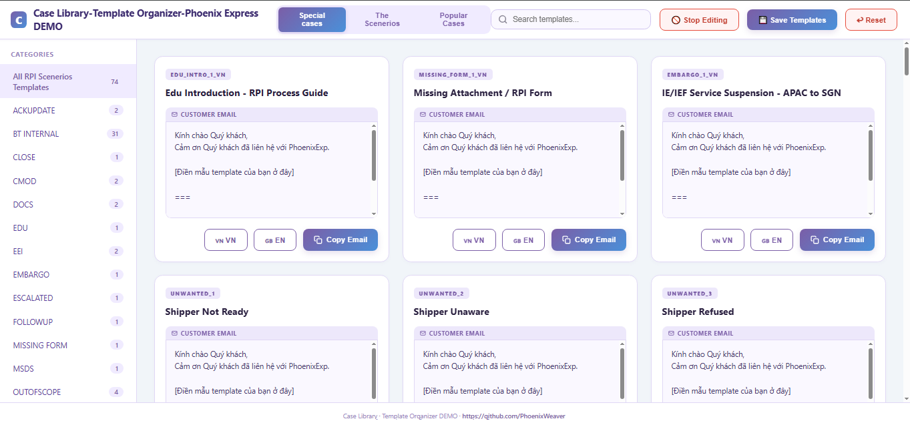
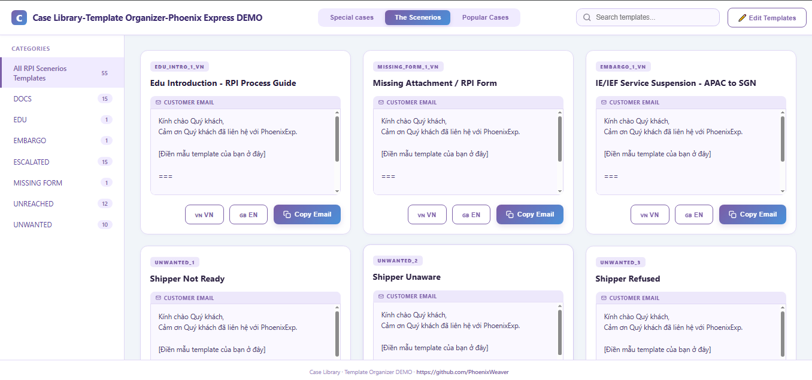
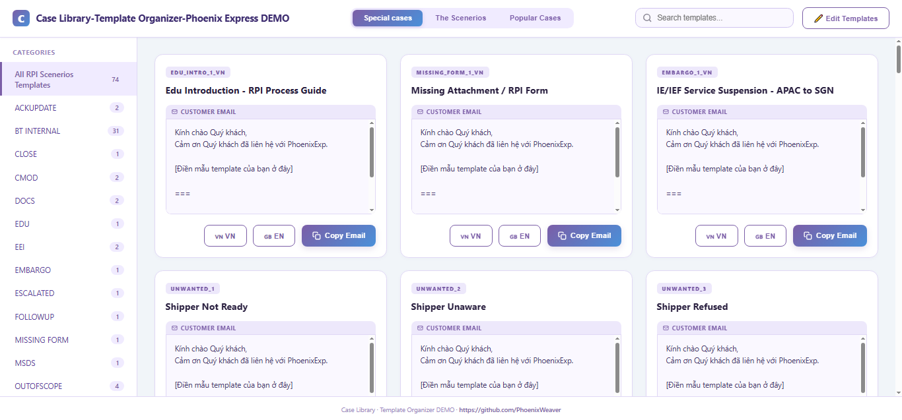

# 📋 Case Library and Templates Organizer  — README

**File:** `caselibrary.html`

---

## 💡 Why This Tool Exists

> **Do you have hundreds of cases and templates to manage every day?**
> **Do you need hundreds of notes and pages just to keep your templates organized?**
> **Do you need to remember hundreds of scenarios and cases by heart?**

You shouldn't have to.

The **Quantum Processor Case Library** was built for exactly this problem. Instead of digging through folders, scrolling through shared docs, or memorizing which template fits which scenario — everything lives in one place, instantly searchable, always ready to copy.

One tool. Every template. Zero memory required.

---

## ⚠️ Demo Notice

> **This is a public demo version.**
> All email template bodies and internal notes in this demo are intentionally blank — they display placeholder text only:
>
> ```
> Kính chào Quý khách,
> Cảm ơn Quý khách đã liên hệ với PhoenixExp.
>
> [Điền mẫu template của bạn ở đây]
>
> ===
>
> Dear Valued Customer,
> Thank you for contacting PhoenixExp.
>
> [Insert your template here]
> ```
>
> Internal notes show:
> ```
> Dear ORG. [Insert your note here]
> ```
>
> No real case content, internal procedures, or proprietary messaging is exposed in this demo.
> The full version contains complete bilingual templates for every scenario.
> Use the **✏️ Edit Templates** + **💾 Save Templates** feature to fill in your own content.

---

## 🚀 Overview

The **DEMO blank templates Case Library** is a self-contained web tool designed to streamline the handling of Logistic PickUp cases. It serves as a centralized, interactive repository of pre-written email templates and internal notes covering every common customer service scenario.

Core goals:
- **Standardize Communication** — Every agent sends consistent, approved messaging.
- **Increase Efficiency** — Find and send the right response in seconds, not minutes.
- **Reduce Errors** — Clear, editable templates eliminate copy-paste mistakes.
- **Personalize at Scale** — Edit and permanently save your own version of any template.

---

## ✨ Key Features

### 1. Library Switching
- **Special Cases** — Bilingual templates (Vietnamese + English) for cross-region cases.
- **The Scenarios** — The complete collection of all the scenario templates.
- **Pop cases** — Templates tailored specifically for the Vietnam region.

### 2. Category Sidebar Navigation
- Filter templates instantly by category: `UNREACHED`, `DOCS`, `CMOD`, `ESCALATED`, `PUP STATUS`, and more.
- Each category displays a live count of templates inside it.

### 3. Live Search
- Real-time filtering as you type — search by template **ID**, **title**, or any **word inside the body or note**.
- No need to know the exact name. Type a keyword and the right template surfaces immediately.

### 4. Dual-Language Templates
- Many templates carry both Vietnamese and English in a single card body.
- One copy action delivers both languages — no switching, no extra steps.

### 5. Inline Quick Editing
- Click directly inside any **Customer Email** or **Internal Note** field to make quick, one-off edits before copying.
- Replace placeholders like `[AWB Number]` or `[NEW AWB]` on the fly without entering edit mode.

### 6. Separate Copy Buttons
- **Copy Email** — Copies the customer-facing response. Disabled automatically for `[Internal Note Only]` cards.
- **Copy Note** — Copies the internal note for pasting into GSP, team chats, or case logs.

---

## 🖊️ Edit, Save & Reset Templates

This is the most powerful feature of the Case Library. You are not locked into the default templates — you can **permanently customize them** to match your team's exact language, tone, and workflow.

### ✏️ Edit Templates

Click the **✏️ Edit Templates** button in the top-right toolbar to enter Edit Mode.

- Every **Customer Email** body and **Internal Note** across all visible cards becomes fully editable.
- The button turns red and changes to **🚫 Stop Editing** to clearly signal you are in edit mode.
- The **💾 Save Templates** and **↩ Reset** buttons appear automatically alongside it.
- Make any changes you need — reword sentences, update contact details, add your team's signature, remove sections that don't apply.
- Click **🚫 Stop Editing** again to exit edit mode without saving.


*Edit Mode active — all email bodies and internal notes become fully editable directly on the card.*

> **Tip:** You can still use the search bar and category sidebar while in edit mode to navigate to the template you want to change.

---

### 💾 Save Templates

Click **💾 Save Templates** to permanently save all your edits for the current library.

- Edits are saved to your browser's **`localStorage`** — they survive page refreshes, browser restarts, and computer reboots.
- Saves are **per library** — edits to `The Scenarios` do not affect `Pop cases` or `Special Cases`.
- A **✅ Saved!** confirmation flashes on the button so you know it worked.
- The next time you open the page, your saved versions load automatically — the defaults are replaced with your customized text.

**What gets saved:**

| Content | Saved? |
|---|---|
| Customer Email body | ✅ Yes |
| Internal Note text | ✅ Yes |
| Card title / ID | ✅ Used as identifier |
| Library selection | ✅ Per library |

> **Storage:** `localStorage` is browser-local. Edits are saved on your machine only and are not shared with other users or devices.

---

### ↩ Reset Templates

Click **↩ Reset** to discard all saved edits for the current library and restore the original defaults.

- A confirmation dialog appears before anything is deleted — no accidental resets.
- Only the **current library** is reset. Other libraries keep their saved edits.
- The page reloads automatically with the original default templates restored.

> **Use this when:** A template has been updated in the source file and you want to pull in the new default, or when you want to start your customization fresh.

---

### Edit / Save / Reset — Full Workflow Example

```
1. Open the Case Library
2. Switch to the library you want to customize (e.g. The Scenarios)
3. Click ✏️ Edit Templates
4. Find the template you want to change (use search or sidebar)
5. Click inside the email body or note and make your edits
6. Repeat for any other templates in this library
7. Click 💾 Save Templates → ✅ Saved! confirms success
8. Click 🚫 Stop Editing to exit edit mode
9. Refresh the page — your edits are still there
```

---

## 📸 Screenshots

### 1. Main Library Interface

*The main interface showing the category sidebar, search bar, and template cards.*

### 2. Dual-Language Template

*A dual-language template providing both Vietnamese and English content in a single card.*

### 3. Editable Templates

*Edit Mode — click any card field to customize the template text permanently.*

---

## 📖 How to Use — Step by Step

1. **Select a Library** — Choose `Special Cases`, `The Scenarios`, or `Pop Cases` from the top switcher.
2. **Find the Template** — Use the sidebar to filter by category, or type a keyword in the search bar.
3. **Quick Edit (one-off)** — Click directly inside any field and type your changes before copying. These edits are temporary and not saved.
4. **Permanent Edit** — Click **✏️ Edit Templates**, make your changes across any cards, then click **💾 Save Templates**.
5. **Copy** — Click **Copy Email** for the customer response, or **Copy Note** for the internal note.
6. **Paste** — Paste into your email client, CRM, GSP, or team chat.
7. **Reset if needed** — Click **↩ Reset** to restore defaults for the current library.

---

## 🛠️ Technical Details

- **Technology:** Pure HTML, CSS, and vanilla JavaScript — no frameworks, no build tools, no dependencies.
- **Data Source:** All templates are stored in a single JavaScript object inside the HTML file. Completely self-contained.
- **Persistence:** Saved edits use the browser's `localStorage` API. No backend, no server, no account required.
- **Portability:** Open the file directly in any modern browser. Works offline.
- **Security:** Right-click, F12, and source inspection are disabled to protect template content.

---

*Quantum Processor Case Library — Built for speed, built for scale. © 2026 PhoenixFlix.*
