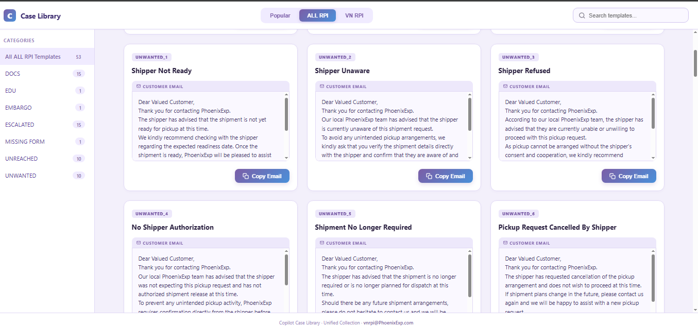
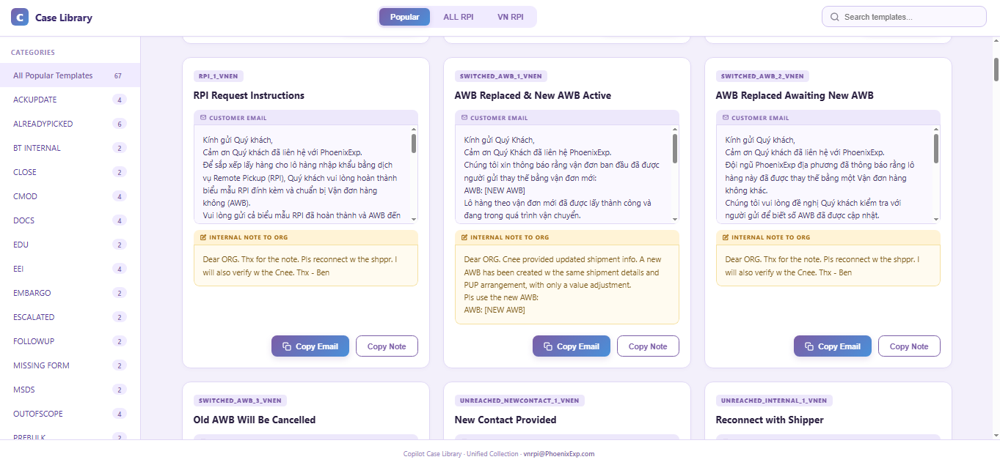

#  Copilot Case Library - README

**File:** `RPILIB.html`

## 🚀 Overview

The **Copilot Case Library** is a self-contained web tool designed to streamline the handling of Remote Pickup Invoice (RPI) cases. It serves as a centralized, interactive repository of pre-written email templates and internal notes for various customer service scenarios.

The primary goals of this tool are:
- **Standardize Communication:** Ensure all agents use consistent, approved messaging.
- **Increase Efficiency:** Drastically reduce the time it takes to find and send common responses.
- **Reduce Errors:** Minimize mistakes by providing clear, editable templates for complex cases.

---

## ✨ Key Features

The Case Library is built with several key features to maximize agent productivity:

#### 1. **Library Switching**
- **Popular:** A curated list of the most frequently used templates.
- **ALL RPI:** The complete collection of all available RPI templates.
- **VN RPI:** Templates specifically tailored for the Vietnam (VN) region, often including dual-language (Vietnamese/English) content.

#### 2. **Category Navigation**
- A dynamic sidebar allows users to filter the visible templates by their assigned category (e.g., `UNREACHED`, `DOCS`, `CMOD`, `ESCALATED`).
- Each category shows a count of the templates it contains.

#### 3. **Live Search**
- The search bar at the top right filters templates in real-time.
- Users can search by **ID** (`CMOD_1`), **Title** (`C-MOD Created`), or any **content** within the email body or internal note.

#### 4. **Dual-Language Templates**
- Many templates, especially in the `VN RPI` library, provide both Vietnamese and English versions of the response in a single body, making it easy to communicate with a diverse customer base.

#### 5. **Inline Editing**
- Both the customer-facing **email body** and the **internal note** are presented in `contenteditable` fields.
- This allows agents to make necessary modifications—such as adding an AWB number, a customer's name, or specific details—directly within the card before copying.

#### 6. **Separate Copy Buttons**
- **Copy Email:** Copies the (potentially edited) customer-facing response to the clipboard. This button is disabled for templates marked as `[Internal Note Only]`.
- **Copy Note:** Copies the (potentially edited) internal note, perfect for pasting into case management systems (like GSP), team chats, or internal logs.

---

## 📸 Screenshots

### 1. Main Library Interface

*The main interface of the Copilot Case Library, showing the category sidebar, search bar, and template cards.*

### 2. Dual-Language Template

*An example of a dual-language template, providing both Vietnamese and English content for efficient communication.*

---

## � How to Use

Using the tool is straightforward:

1.  **Select a Library:** Choose the library that best fits your needs (`Popular`, `ALL RPI`, or `VN RPI`).
2.  **Find the Template:**
    - Use the **sidebar** to filter by a specific category (e.g., "UNREACHED").
    - Or, use the **search bar** to find a template by keyword.
3.  **Review and Edit:**
    - Locate the correct case card.
    - Click inside the "Customer Email" or "Internal Note" fields to make any necessary edits. For example, replace `#[AWB]` with the actual tracking number.
4.  **Copy the Content:**
    - Click the **Copy Email** button to copy the main response.
    - Click the **Copy Note** button to copy the internal note.
5.  **Paste:** Paste the copied content into your email client, CRM, or internal chat.

---

## 🛠️ Technical Details

- **Technology:** The tool is built with pure HTML, CSS, and vanilla JavaScript, making it extremely lightweight, fast, and portable.
- **Data Source:** All case templates are stored in a single JavaScript object (`LIBRARIES`) directly within the `RPILIB.html` file. This means the tool is completely self-contained and requires no backend, database, or network requests to function.
- **Dependencies:** There are no external dependencies. The tool can be run locally by simply opening the HTML file in a web browser.

---

*This documentation is for the `RPILIB.html` tool. © 2026 PhoenixFlix.*
