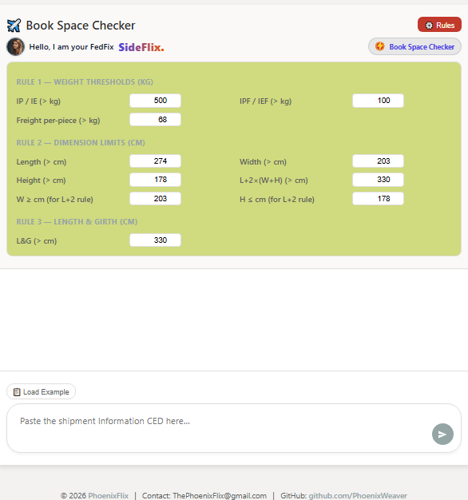
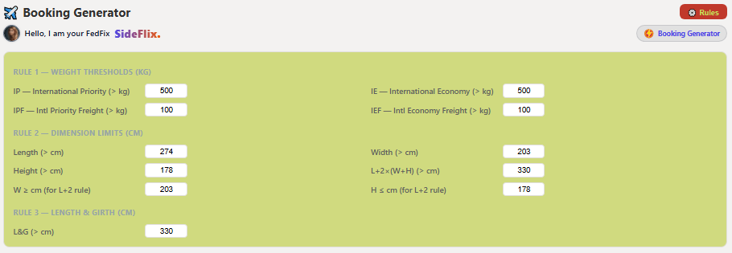
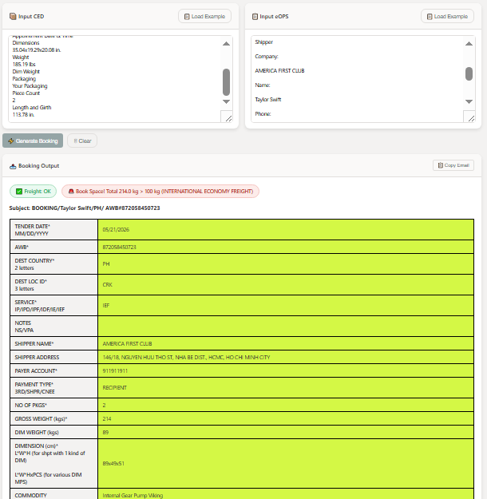
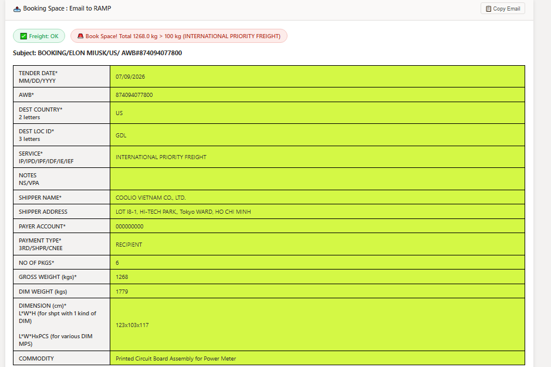
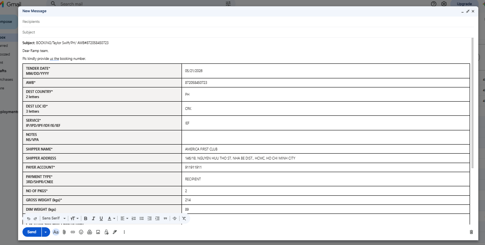
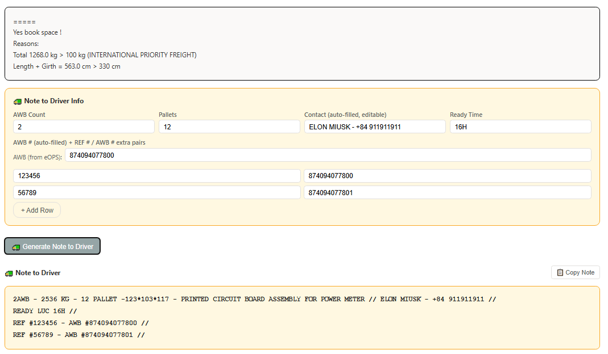
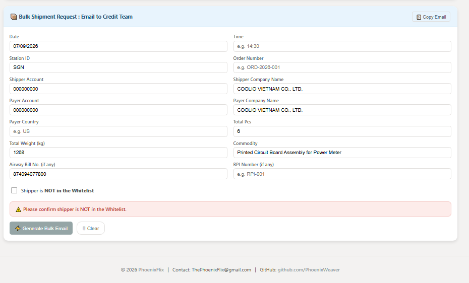
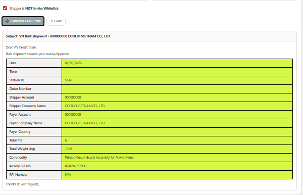

# ✈️ PhoenixExp Logistics Tools — Master Guide

A suite of client-side logistics utilities for PhoenixExp operations. All tools run entirely in the browser — no server, no installation required.

---

## 📚 Tool Index

| Tool | File | README |
|---|---|---|
| 📦 Book Space Checker | `bookable.html` | [README_bookable.md](README_bookable.md) |
| ✈️ Booking Generator | `booking.html` | [README_booking.md](README_booking.md) |
| 🚛 Note to Driver Generator | `note2driver.html` | [README_note2driver.md](README_note2driver.md) |
| 📦 Bulk Shipment Request | `bulkbooking.html` | *(this file — see Section 4)* |

> **Note:** The Booking Generator, Note to Driver, and Bulk Shipment Request are all integrated into `bookingAZ.html` as a single unified workflow.

---

## 1. 📦 Book Space Checker (`bookable.html`)

> Full guide: [README_bookable.md](README_bookable.md)

A standalone tool to quickly determine if a freight shipment requires a space booking. Paste raw CED data, click **Check**, and get an instant Yes/No answer with specific reasons.

**Key features:**
- Parses CED text — service type, weight, dimensions, L&G
- Configurable rules engine (weight thresholds, dimension limits, L&G)
- Flags freight service requirement (per-piece > 68 kg)
- Clear result cards: `✅ No Space Needed` or `🚨 Book Space!`


*Book Space Checker — parsed shipment details and final booking decision.*


*Configurable rules panel — adjust weight and dimension thresholds.*

---

## 2. ✈️ Booking Generator (`booking.html`)

> Full guide: [README_booking.md](README_booking.md)

Generates a complete PhoenixExp booking request email by parsing both CED and eOPS inputs, validating against configurable rules, and producing a pre-filled editable table ready to copy into Outlook.

**Key features:**
- Dual-input parsing (CED + eOPS simultaneously)
- Auto-fills: AWB, shipper, payer, service, weight, dims, commodity
- Validation badges: `✅ Freight: OK`, `⚠️ Freight Required`, `✅ Space Booking: Not Required`, `🚨 Book Space!`
- Editable booking table (click any cell to edit)
- `📋 Copy Email` — copies full HTML email (Subject + table + reasons) for Outlook


*Configurable rules panel — adjust weight and dimension thresholds per service.*


*Generated booking output — validation badges and editable data table.*


*Final HTML email ready to paste into Outlook.*


*Email body with space booking reasons.*

**Output format:**
```
Subject: BOOKING/<Shipper Name>/<Dest Country>/ AWB#<AWB>

Dear Ramp team,
Pls kindly provide us the booking number.

[Booking Table]

=====
Yes book space! / No Space Booking Required.
```

---

## 3. 🚛 Note to Driver Generator (`note2driver.html`)

> Full guide: [README_note2driver.md](README_note2driver.md)

Builds a concise pickup note for the driver, assembled from parsed eOPS/CED data. Located inside the Booking Output panel — appears after generating a booking.

**Key features:**
- Auto-fills contact (Shipper Name + Phone) and AWB from eOPS
- Calculates total weight as `Shipment Weight × AWB Count`
- Converts CED dimensions (in → cm) for the note
- Supports multiple REF # / AWB # pairs for consolidated shipments
- `📋 Copy Note` — copies plain-text note to clipboard


*Input panel — CED and eOPS text areas with Note to Driver info fields.*


*Generated booking table and Note to Driver output.*


*Formatted pickup note ready to copy.*

**Output format:**
```
2AWB - 2536 KG - 12 PALLET -123*103*117 - PRINTED CIRCUIT BOARD ASSEMBLY // ELON MUSK - +84 911911911 //
READY LUC 16H //
AWB #874094077800 //
REF #19076506 - AWB #874094077801 //
```

**Workflow position:** Appears inside the Booking Output panel, between the space booking result and the Bulk Shipment section.

---

## 4. 📦 Bulk Shipment Request (`bulkbooking.html`) — NEW

A dedicated section at the bottom of `bulkbooking.html` for generating VN Credit team approval emails for bulk shipments. Auto-prefills from the same CED/eOPS inputs used for the booking.


*Bulk eligibility check — weight ≥ 300 kg and Not in Whitelist must both be confirmed.*


*Generated bulk shipment email table ready to copy to VN Credit team.*

### 4.1 When to Use

Use the Bulk Shipment Request when:
- Total shipment weight is **≥ 300 kg**, AND
- The shipper is **NOT in the Whitelist**

Both conditions must be confirmed before the email can be generated.

### 4.2 How to Use

#### Step 1 — Paste CED + eOPS (same inputs as Booking Generator)

The bulk section auto-prefills from whatever is already in the CED and eOPS text areas.

#### Step 2 — Review / Edit Auto-Filled Fields

| Field | Auto-filled from | Manual? |
|---|---|---|
| Date | eOPS `Ship Date` | Optional override |
| Time | — | Manual |
| Station ID | eOPS `Origin LOC ID` (3-letter) | Optional override |
| Order Number | — | Manual |
| Shipper Account | eOPS `ACCOUNT` number | Optional override |
| Shipper Company Name | eOPS `Shipper > Company` | Optional override |
| Payer Account | eOPS `ACCOUNT` number | Optional override |
| Payer Company Name | eOPS `Recipient > Company` | Optional override |
| Payer Country | eOPS `Recipient Country/Territory` | Optional override |
| Total Pcs | eOPS `Total Packages` | Optional override |
| Total Weight (kg) | eOPS `Shipment Weight` (or CED lbs→kg) | Optional override |
| Commodity | eOPS `Commodity Description` | Optional override |
| Airway Bill No. | eOPS `Package Tracking Number` | Optional override |
| RPI Number | — | Manual |

#### Step 3 — Confirm Eligibility

Before generating, two conditions must be met:

- ☑️ **Total Weight ≥ 300 kg** — validated automatically from the weight field
- ☑️ **"Shipper is NOT in the Whitelist"** — checkbox must be manually ticked

If either condition fails, a red warning is shown and generation is blocked:
- `⚠️ Total weight is X kg — must be ≥ 300 kg for bulk shipment.`
- `⚠️ Please confirm shipper is NOT in the Whitelist.`

#### Step 4 — Generate Bulk Email

Click **`⚡ Generate Bulk Email`**. The output panel appears showing:

- **Subject line**: `VN Bulk shipment - <Order Number> <Shipper Account> <Shipper Name>`
- **Email body**: `Dear VN Credit team, / Bulk shipment require your review/approval.`
- **Data table**: All 14 fields in the same styled yellow-cell table format as the booking output (editable cells)
- **Sign-off**: `Thanks & Best regards,`

#### Step 5 — Copy Email

Click **`📋 Copy Email`** in the bulk section header. Copies both:
- **Rich HTML** (styled table with yellow cells) — paste into Outlook
- **Plain text** fallback — paste anywhere

### 4.3 Email Template

```
To: VN-Bulk Approval <vn-bulkapproval@PhoenixExp.com>
Subject: VN Bulk shipment - <Order Number> <Shipper Account> <Shipper Name>

Dear VN Credit team,

Bulk shipment require your review/approval.

Date: 07/09/2026
Time: 14:30
Station ID: SGN
Order Number: ORD-2026-001
Shipper Account: 123456789
Shipper Company Name: COOLIO VIETNAM CO., LTD.
Payer Account: 123456789
Payer Company Name: AMERICA FIRST BANK
Payer Country: US
Total Pcs: 6
Total Weight (kg): 1268
Commodity: Printed Circuit Board Assembly for Power Meter
Airway Bill No.: 874094077800
RPI Number: N/A

Thanks & Best regards,
```

### 4.4 Business Rules

| Rule | Condition | Behaviour |
|---|---|---|
| Weight threshold | Total weight **< 300 kg** | ⚠️ Blocked — warning shown |
| Whitelist check | Checkbox **not ticked** | ⚠️ Blocked — warning shown |
| Both passed | Weight ≥ 300 kg **AND** checkbox ticked | ✅ Email generated |

---

## 5. Unified Workflow in `bulkbooking.html`

The full end-to-end workflow for a single shipment:

```
1. Paste CED + eOPS
        ↓
2. ⚡ Generate Booking
   → Booking table (editable) + space booking result
        ↓
3. 🚛 Generate Note to Driver
   → Pickup note (auto-filled from eOPS/CED)
        ↓
4. ⚡ Generate Bulk Email  (if weight ≥ 300 kg + not whitelisted)
   → VN Credit team approval email
```

All three outputs can be copied independently and pasted into Outlook.

---

## 🔧 Technical Notes

- **Frontend only**: Pure Vanilla JavaScript, HTML5, CSS3. No frameworks, no backend, no dependencies.
- **Parsing**: Regex-based extraction from unstructured CED and eOPS text blocks.
- **Auto-fill protection**: Contact and AWB fields track manual edits via `dataset.edited` — auto-fill only runs if the user has not overridden the field.
- **Unit conversion**: CED dimensions in inches are automatically converted to cm; weights in lbs are converted to kg.
- **Editable output**: All table cells in the booking and bulk output are `contenteditable` — values can be corrected before copying.
- **Clear button**: Resets all inputs, outputs, auto-filled fields, checkboxes, and edit flags.

---

*Designed for internal PhoenixExp logistics operations to streamline booking requests, driver pickup communication, and bulk shipment credit approvals.*
