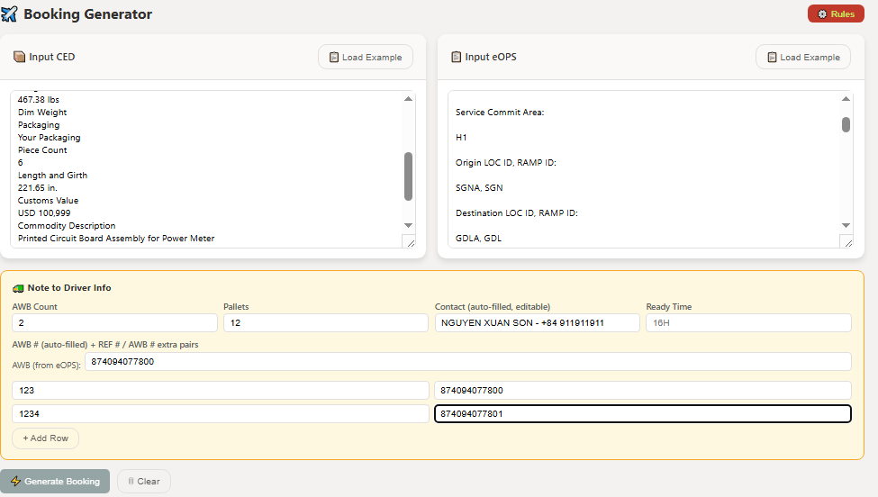
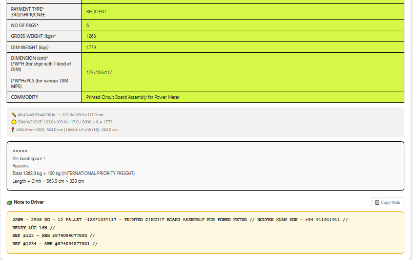

# ✈️ Booking & Note to Driver Generator Demo

An internal web-based tool that streamlines the booking process by generating a formal **booking request email** for the Ramp Team and a concise **Note to Driver** for pickup instructions. All processing is performed locally in the browser, ensuring that no server infrastructure is required.

---

## 🚀 Features

- **Dual-Input Parsing**: Extracts shipment details from both raw **CED** and **eOPS** text simultaneously.
- **Auto-Fill from eOPS**: Shipper name, phone, and AWB number are automatically populated into the Note to Driver fields — no manual entry needed.
- **Automated Booking Validation**:
  - Flags if a shipment must be upgraded to a Freight service (per-piece weight > 68 kg).
  - Determines if space booking is required by checking total weight and dimensions against configurable service thresholds (IP, IE, IPF, IEF).
  - Generates a pre-filled, editable booking table and a complete HTML email ready for Outlook.
- **Note to Driver Builder**:
  - Assembles a formatted pickup note from parsed data.
  - Auto-fills contact (Shipper Name + Phone) and AWB from eOPS.
  - Calculates total weight as `Shipment Weight × AWB Count`.
  - Supports multiple REF # / AWB # pairs for consolidated shipments.
  - One-click copy of the plain-text note.
- **Configurable Rules Panel**: Adjust weight and dimension thresholds per service in real time via `⚙️ Rules`.
- **Dimension Conversion**: Automatically converts inches → cm and calculates Dim Weight and L&G.

---

## 📖 Usage Guide

## 📸 Screenshots

### Input Panel

*CED and eOPS input panels with the Note to Driver info section below.*

### Output Panel

*Generated booking table, validation badges, and the formatted Note to Driver output.*

---

## 📖 Usage Guide

### Step 1 — Paste Input Data

- Paste **CED** (Shipment Information) into the left textarea.
- Paste **eOPS** details into the right textarea.
- Use `📋 Load Example` in each panel to see the expected format.

### Step 2 — Fill Note to Driver Info

Located in the yellow panel below the inputs. Most fields are auto-filled after Generate:

| Field | Source |
|---|---|
| **AWB Count** | Manual — number of AWBs for this pickup |
| **Pallets** | Manual — total pallet count |
| **Contact** | Auto-filled: Shipper Name + Phone from eOPS (editable) |
| **Ready Time** | Manual — e.g. `16H` |
| **AWB # (from eOPS)** | Auto-filled from `Package Tracking Number` in eOPS (editable) |
| **REF # / AWB # pairs** | Manual — use `+ Add Row` for additional pairs |

> Fields marked auto-filled will not be overwritten if you have manually edited them.

### Step 3 — (Optional) Adjust Rules

Click `⚙️ Rules` to expand the rules panel and modify weight/dimension thresholds per service. Changes apply instantly on next generate.

### Step 4 — Generate

Click `⚡ Generate Booking`. The tool will:
1. Parse both inputs.
2. Run validation checks.
3. Display the full output panel.

### Step 5 — Review & Copy

The output panel has two sections:

#### 📋 Booking Email
- **Validation badges** — `✅ Freight: OK`, `⚠️ Freight Required`, `✅ Space Booking: Not Required`, or `🚨 Book Space!`
- **Booking table** — editable cells, pre-filled with all shipment data.
- **Dim/L&G note** — shows conversion breakdown and calculated values.
- **Email body** — space booking reasons (if any).
- Click **`📋 Copy Email`** to copy the full HTML-formatted email (Subject + table + reasons) ready to paste into Outlook.

#### 🚛 Note to Driver
- Formatted note in the standard logistics format:
```
2AWB - 2536 KG - 12 PALLET - 123*103*117 - PRINTED CIRCUIT BOARD ASSEMBLY FOR POWER METER // NGUYEN XUAN SON - +84 911911911 //
READY LÚC 16H //
REF #911911 - AWB #874094077000 //
REF #311311 - AWB #874094077001 //
```
- Click **`📋 Copy Note`** to copy the plain-text note to clipboard.

---

## 📐 Business Rules

### 1. Freight Requirement
A shipment is flagged `⚠️ Freight Required` if any single piece exceeds **68 kg**. Standard carrier rule for parcel vs. freight classification.

### 2. Space Booking Requirement
A shipment is flagged `🚨 Book Space!` if it violates any rule in the `⚙️ Rules` panel:
- **Total Weight** — exceeds the threshold for the service (e.g., > 100 kg for IPF/IEF).
- **Dimensions** — exceeds max length, width, or height.
- **Length & Girth** — `L + 2×(W+H)` exceeds the configured limit.

---

## 🔧 Technical Notes

- **Frontend only**: Pure Vanilla JavaScript, HTML5, CSS3. No frameworks, no backend.
- **Parsing**: Regex-based extraction from unstructured CED and eOPS text.
- **Auto-fill protection**: Contact and AWB fields track manual edits via `dataset.edited` — auto-fill only runs if the user hasn't overridden the field.
- **Clear button**: Resets all inputs, outputs, and auto-filled fields including their edit flags.

---

 ~~ Demo Proposal – Designed for internal logistics operations to streamline booking requests and driver pickup communications. ~~
    ©2026 PhoenixFlix | Contact: ThePhoenixFlix@gmail.com | GitHub: github.com/PhoenixWeaver
