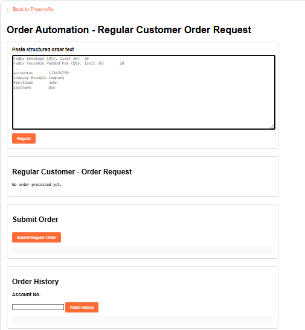
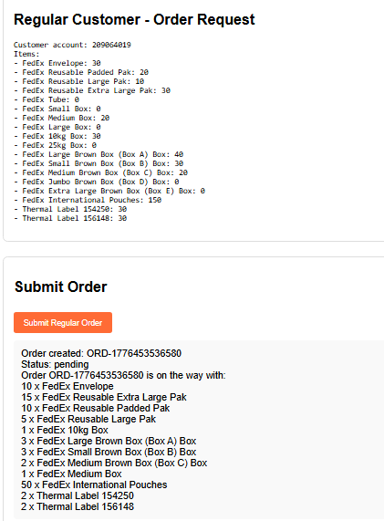

# 📚 Order Automation System

A comprehensive web-based order automation system for FedEx supply management, designed to streamline customer supply order processing with intelligent allocation algorithms and duplicate prevention.

## 🚀 Features

### Core Functionality
- **Intelligent Order Parsing**: Automatically parses structured text input containing customer details and supply items
- **Smart Allocation System**: Applies global category limits with proportional distribution algorithms
- **Duplicate Order Protection**: Prevents multiple pending orders for the same customer account
- **Order History Tracking**: Complete audit trail with order status and approval details
- **Real-time Processing**: Instant order validation and approval with detailed summaries

### Supply Management
- **Category-Based Limits**:
  - Envelopes: Maximum 10 units total
  - Boxes: Maximum 10 units with weight-based allocation
  - Paks: Maximum 30 units total
- **Item-Specific Limits**: Individual caps for specialized items like thermal labels
- **Flexible Quantity Controls**: Supports both global and per-item quantity restrictions

### User Interface
- **Clean Web Interface**: Intuitive browser-based application
- **Real-time Feedback**: Immediate parsing results and submission responses
- **Order History Viewer**: Account-based order retrieval and status tracking
- **Responsive Design**: Works across different screen sizes and devices

## 📸 Screenshots

### Main Application Interface


*Main dashboard showing order input, parsing controls, and submission interface*

### Order Processing Output


*Example of parsed order output with approval details and allocation breakdown*

## 🔧 Technical Architecture

### Backend (Node.js/Express)
- **Framework**: Express.js for RESTful API development
- **Data Management**: In-memory order storage with unique order IDs
- **Validation**: Comprehensive input validation and error handling
- **Allocation Engine**: Proportional distribution algorithm for limited resources

### Frontend (Vanilla JavaScript)
- **Interface**: Pure HTML/CSS/JavaScript implementation
- **API Integration**: RESTful client with async/await patterns
- **Data Parsing**: Flexible text parsing supporting multiple formats
- **State Management**: Client-side order state handling

## 📋 API Endpoints

### Order Management
- `POST /orders` - Submit new customer order
- `GET /orders/:accountNo` - Retrieve order history by account
- `GET /orders` - Get all orders (admin endpoint)
- `GET /order/:orderId` - Get specific order details

### Request/Response Examples

#### Submit Order
```json
POST /orders
{
  "items": [
    {
      "itemName": "FedEx Envelope",
      "requestedQty": 5,
      "qtyLimit": 30
    }
  ],
  "customer": {
    "accountno": "698583622",
    "firstname": "John",
    "lastname": "Doe"
  }
}
```

#### Order Response
```json
{
  "orderId": "ORD-1640995200000",
  "customer": { ... },
  "approvedItems": [
    {
      "itemName": "FedEx Envelope",
      "requestedQty": 5,
      "approvedQty": 5,
      "category": "envelope"
    }
  ],
  "status": "pending",
  "summary": "Order ORD-1640995200000 is on the way with:\n5 x FedEx Envelope"
}
```

## 🛠 Installation & Setup

### Prerequisites
- Node.js (v14 or higher)
- npm package manager

### Quick Start
```bash
# Clone or download the project
cd order-automation

# Install dependencies
npm install

# Start the server
npm start

# Open in browser
# http://localhost:3000
```

### Development
```bash
# For development with auto-restart
npm install -g nodemon
nodemon server.js
```

## 📖 Usage Guide

### 1. Order Input
Paste structured order text in the textarea, following this format:
```
FedEx Envelope (Qty. limit 30)	5
FedEx Small Box (Qty. limit 20)	3
accountno	698583622
firstname	John
lastname	Doe
```

### 2. Parse Order
Click "Regular" button to parse and validate the order text. The system will:
- Extract customer information
- Parse item quantities and limits
- Validate data completeness

### 3. Submit Order
Click "Submit Regular Order" to process the order. The system will:
- Apply category limits and allocation algorithms
- Check for duplicate pending orders
- Generate order ID and approval summary
- Return processing results

### 4. View History
Enter an account number and click "Fetch History" to view:
- All orders for the account
- Order status (pending/processed)
- Approval details and summaries

## 🔍 Key Functions

### Order Processing Algorithm
1. **Input Validation**: Ensures required fields and valid quantities
2. **Category Classification**: Automatically categorizes items (envelope/box/pak/other)
3. **Limit Application**: Applies global and item-specific quantity limits
4. **Proportional Allocation**: Distributes limited resources fairly across requests
5. **Duplicate Prevention**: Blocks new orders for accounts with pending requests

### Allocation Logic
- **Proportional Distribution**: Items receive quantities based on their proportion of total requests
- **Remainder Handling**: Extra units allocated to highest-remainder items
- **Category Separation**: Different limits applied per supply category

### Data Parsing
- **Flexible Format Support**: Handles tab-separated, space-separated, and mixed formats
- **Customer Field Extraction**: Automatically identifies account numbers and contact details
- **Item Limit Parsing**: Extracts quantity limits from item descriptions

## 🔒 Security & Validation

- **Input Sanitization**: All inputs validated and sanitized
- **Account Validation**: Ensures valid account numbers for order processing
- **Quantity Bounds**: Prevents negative or excessively large quantities
- **Duplicate Protection**: Maintains data integrity by preventing conflicting orders

## 📊 Order Categories

### Envelopes (Limit: 10 total)
- FedEx Envelope

### Paks (Limit: 30 total)
- FedEx Reusable Padded Pak
- FedEx Reusable Large Pak
- FedEx Reusable Extra Large Pak

### Boxes (Limit: 10 total)
- FedEx Small Box
- FedEx Medium Box
- FedEx Large Box
- FedEx 10kg Box

## 👤 User Info

Source available on GitHub: https://github.com/PhoenixWeaver
- FedEx 25kg Box
- FedEx Large Brown Box
- FedEx Small Brown Box
- FedEx Medium Brown Box
- FedEx Jumbo Brown Box
- FedEx Extra Large Brown Box

### Special Items
- FedEx International Pouches (Limit: 50)
- Thermal Label 154250 (Limit: 2)
- Thermal Label 156148 (Limit: 2)

## 🚀 Deployment

### Production Setup
```bash
# Set environment variables
export PORT=3000

# Use PM2 for production
npm install -g pm2
pm2 start server.js --name "order-automation"
```

### Docker Deployment
```dockerfile
FROM node:14-alpine
WORKDIR /app
COPY package*.json ./
RUN npm install
COPY . .
EXPOSE 3000
CMD ["npm", "start"]
```

## 🤝 Contributing

1. Fork the repository
2. Create a feature branch
3. Make your changes
4. Add tests if applicable
5. Submit a pull request

## 📄 License

This project is licensed under the MIT License - see the LICENSE file for details.

## 📞 Support

For questions or support, please contact the development team or create an issue in the repository.

---

*Built with Node.js, Express.js, and vanilla JavaScript for reliable supply chain automation.*
