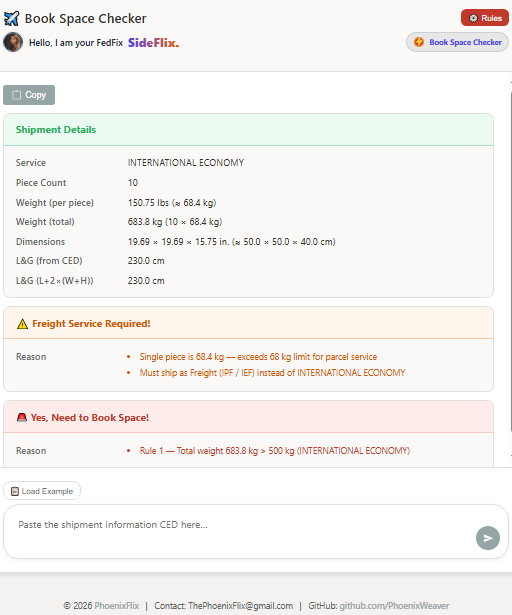

# ✈️ Book Space Checker (`bookable.html`) - User Guide

## 1. Overview

The **Book Space Checker** is a client-side utility designed to quickly determine if a freight shipment requires a space booking. It parses raw shipment data (typically from a Customer Entered Data or "CED" block), applies a set of configurable rules based on service type, weight, and dimensions, and provides a clear "Yes" or "No" answer.

This tool is built as a standalone HTML file with vanilla JavaScript, making it portable, fast, and easy to use without any server-side dependencies.

## 📸 Screenshot

*Example of the tool's output, showing parsed shipment details and the final booking decision.*

## 2. How to Use

1.  **Paste Shipment Data**: Copy the shipment information text block and paste it into the main text area.
    - You can use the **`📋 Load Example`** button to see the expected format.
2.  **Check Data**: Click the **`Check`** button (or press `Ctrl+Enter`).
3.  **Review Results**: The tool will instantly display three result cards:
    -   **Shipment Details**: A summary of the parsed data.
    -   **Freight Service Check**: A warning if a parcel shipment is too heavy and must be upgraded to a freight service.
    -   **Space Booking Check**: The final "Yes" or "No" answer regarding the need to book space.

## 3. Understanding the Results

### Shipment Details Card
This card shows the key information extracted from your input. It automatically converts units for standardization (e.g., `lbs` to `kg`, `in` to `cm`).

-   **Service**: The detected shipping service (e.g., `International Economy`).
-   **Piece Count**: The number of pieces in the shipment.
-   **Weight (per piece)**: The weight of a single piece.
-   **Weight (total)**: The total gross weight of the shipment.
-   **Dimensions**: The dimensions of a single piece, shown in both original and metric units.
-   **L&G (from CED)**: The "Length and Girth" value if it was explicitly found in the input text.
-   **L&G (L+2×(W+H))**: The "Length and Girth" calculated from the parsed dimensions.

### Freight Service Check Card
This card validates if the shipment qualifies for standard parcel service based on its per-piece weight.

-   **`✅ Freight Service: OK`**: The weight of a single piece is within the allowed limits for a parcel service (e.g., ≤ 68 kg).
-   **`⚠️ Freight Service Required!`**: The weight of a single piece exceeds the parcel limit. The shipment **must be sent as a Freight service** (IPF/IEF), and the reason will be displayed.

### Space Booking Check Card
This is the primary result of the tool. It tells you whether you need to contact the ramp to book space for the shipment.

-   **`✅ No, Don't Need to Book Space.`**: The shipment's total weight and dimensions are within all standard limits.
-   **`🚨 Yes, Need to Book Space!`**: The shipment violates one or more rules. The specific reasons are listed, indicating exactly which threshold was exceeded (e.g., `Rule 1 — Total weight...`, `Rule 2 — Length...`).

## 4. The Rules Engine

The tool's logic is based on a configurable set of rules that can be viewed and modified by clicking the **`⚙️ Rules`** button.

Editable Rules Panel
*The slide-out panel where users can adjust weight and dimension thresholds.*

### Rule 1: Weight Thresholds
-   **IP / IE**: The maximum total shipment weight for standard parcel services.
-   **IPF / IEF**: The maximum total shipment weight for freight services.
-   **Freight per-piece**: The maximum weight for a single piece in a *parcel* shipment before it must be re-classified as freight.

### Rule 2: Dimension Limits
-   **Length / Width / Height**: The maximum allowed value for any single dimension.
-   **L+2×(W+H)**: A special girth calculation that applies only when specific Width and Height conditions are met (`W ≥ 203 cm` and `H ≤ 178 cm`).

### Rule 3: Length & Girth (L&G)
-   **L&G**: The maximum allowed value for the shipment's Length & Girth. The tool checks both the value provided in the CED and the value it calculates from the dimensions.

## 5. Key Features

-   **Standalone & Portable**: A single HTML file with no external dependencies.
-   **Instant Results**: All parsing and logic run instantly in the browser.
-   **Unit Conversion**: Automatically handles and converts `lbs`/`kg` and `in`/`cm`.
-   **Clear Feedback**: Provides specific reasons for why a booking is or is not required.
-   **Configurable Rules**: Allows for easy adjustment of thresholds without editing the code.
-   **Copy to Clipboard**: The `Copy` button formats the results for easy pasting into emails or other documents.
